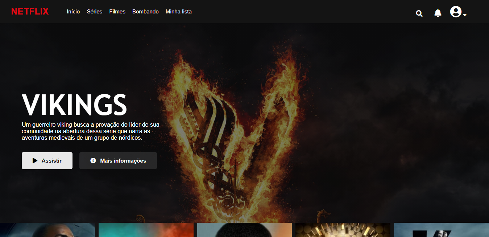

# Recriando a tela do netflix

HTML, JS e CSS

Depois de quase pronto, a noção surgiu na minha cabeça, a maioria desses filmes e séries não tem na Netflix, mas estou com preguiça de trocar e o que importa é que o carrosel de filmes funciona. 

Pra visualizar no seu PC é só baixar todo o projeto e abrir o arquivo index.html.